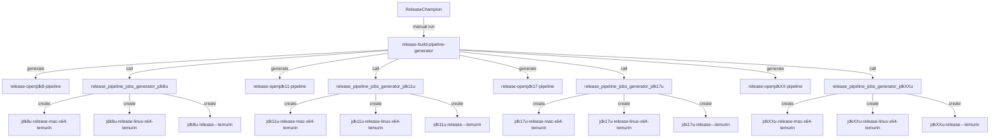
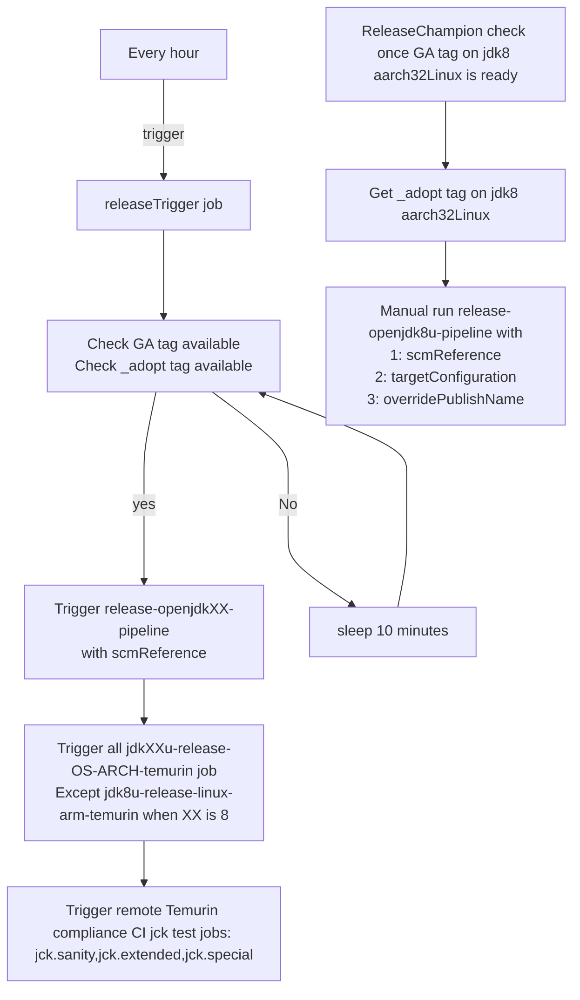

<!-- textlint-disable terminology -->
# Temurin Release Guide

Don't be scared off by this document! If you already understand the stuff in the glossary section and are only working on a HotSpot release, then skip to [Steps for every version](#steps-for-every-version) later on.

## Release glossary and background information

### OpenJDK Vulnerability Group

- A private group of trusted people who take reports of vulnerabilities in the openjdk codebase and work to resolve them and get them into releases in a timely manner

### Non-Oracle (usually Red Hat) maintained OpenJDK Quarterly Patch Set Update (PSU)

- Maintainers work on quarterly update fixes for the next update, in the head stream of the updates repository e.g. <https://hg.openjdk.java.net/jdk-updates/jdk11u>
- Fixes for the subsequent update are developed in the `dev` stream e.g. <https://hg.openjdk.java.net/jdk-updates/jdk11u-dev/>
- Regular builds are tagged every week or so, e.g. `jdk-11.0.5+6`
- Eventually after final testing it comes to general availability (GA) day for the update, at this point any fixes from the Vulnerability Group are merged with the final GA build, and tagged, e.g. `jdk-11.0.5+10`, `jdk-11.0.5-ga`

### Oracle Managed OpenJDK Quarterly PSU

- The most recent JDK release updates are managed by Oracle, and there will only be two of them, e.g. for `jdk-13` Oracle produced `jdk-13.0.1` and `jdk-13.0.2`.  
- Oracle work on the quarterly updates internally and these update source branches and Vulnerability Group fixes are not public until GA date.
- On GA day, Oracle merges the internal branch and Vulnerability Group fixes to produce the final GA build, and this is tagged, e.g. `jdk-13.0.1+9`, `jdk-13.0.1-ga`
- If the release is a short term support release there are no more releases after the two Oracle-led updates, but if it is a long term support (LTS) release the OpenJDK community picks up subsequent release maintenance, and all work continues in public as described above.

## OpenJDK Quarterly/New Release Process

- Wait for Red Hat/Oracle to push the GA code to GitHub and announce availability:
  - jdk8u : <https://github.com/openjdk/jdk8u>
    - Announce: <https://mail.openjdk.java.net/pipermail/jdk8u-dev/>
  - jdk11u:  <https://github.com/openjdk/jdk11u>
    - Announce: <https://mail.openjdk.java.net/pipermail/jdk-updates-dev/>
  - jdk17u:  <https://github.com/openjdk/jdk17u>
    - Announce: <https://mail.openjdk.java.net/pipermail/jdk-updates-dev/>
  - jdkXX: <https://github.com/openjdk/jdkXX/>
    - Announce: <https://mail.openjdk.java.net/pipermail/jdk-dev/>

### Lockdown period

During the week before release, the Release Champion makes changes in preparation for the release:

- Update [releaseVersions](https://github.com/adoptium/ci-jenkins-pipelines/blob/master/pipelines/build/regeneration/release_pipeline_generator.groovy#L6) with correct incoming release versions.
- Update https://github.com/adoptium/mirror-scripts/blob/master/releasePlan.cfg with expected tag, detail see https://github.com/zdtsw/mirror-scripts/tree/issue/3167#skara-repos-and-processes

Create release branch on below repositories:

- temurin-build <https://github.com/adoptium/temurin-build>
- ci-jenkins-pipelines <https://github.com/adoptium/ci-jenkins-pipelines>
- jenkins-helper <https://github.com/adoptium/jenkins-helper>

`temurin-build` and `ci-jenkins-pipeline` share the same branch name,`jenkins-helper` might have a different branch name.
These branches will require at least one approval to push commit to.

Finally lockdown below repositories

- github-release-scripts <https://github.com/adoptium/github-release-scripts>
- containers <https://github.com/adoptium/containers>
- installer <https://github.com/adoptium/installer>
- mirror-script <https://github.com/adoptium/mirror-scripts>

Only include "critical" fixes (i.e. those which will otherwise cause a build break or other problem which will prevent shipping the release builds).
This stops last minute changes going in, which may destabilise things. "installer" repo might have exception due to the fact it requires new version of build.
If a change has to go in during this "lockdown" period it should be done by posting a comment saying "Requesting approval to merge during the lockdown period. Please thumbs up the comment to approve" in Slack release channel.
If two committers into the repository express approval then the change can be merged during the lockdown period.

Release pipelines and jobs need to be re-generated with new tags by Release Champion:

- run [release-build-pipeline-generator](https://ci.adoptium.net/job/build-scripts/job/utils/job/release-build-pipeline-generator) with correct value:
  1. `releaseTag` is the branch on `ci-jenkins-pipeline` and `temurin-build` git repo.
  2. `helperTag` is the branch on `jenkins-helper` repo.
  3. `aqaTag` is the branch on `aqa-tests` repo, in form of `vX.Y.Z-release` and usually the [latest stable release](https://github.com/adoptium/aqa-tests/releases)
- ensure release-openjdkXX-pipeline in <https://ci.adoptium.net/job/build-scripts> are properly generated for the first time or updated:
  1. jdk8 aarch32Linux shares the same pipeline `release-openjdk8-pipeline` with other jdk8 targets, therefore, only one release pipeline for jdk8
  2. `targetConfigurations` should only include what we officially release for temurin.
  3. `buildReference` and `ciReference` should have the value of `releaseTag` used when we generate pipeline.
  4. `helperReference` should have the same value of `helperTag` used when we generate pipeline.
  5. `additionalConfigureArgs` has correct value, especially in `release-openjdk8-pipeline` it is different than other jdk versions. This requires certain modification manually
- ensure downstream build jobs in <https://ci.adoptium.net/job/build-scripts/job/jobs/job/release/job/jobs/jdkXXu/> are created or updated
  1. `BUILD_CONFIGURATION.USE_ADOPT_SHELL_SCRIPTS` is set to `true`
  2. `DEFAULTS_JSON.repository.build_branch`, `ADOPT_DEFAULTS_JSON.repository.build_branch`, `DEFAULTS_JSON.repository.pipeline_branch` and `ADOPT_DEFAULTS_JSON.repository.pipeline_branch` should get correct release branch name as `releaseTag`
  3. `DEFAULTS_JSON.repository.helper_ref` and `ADOPT_DEFAULTS_JSON.repository.helpe_ref` should get correct release branch name as `helperTag`

Disable nightly testing so the release builds aren't delayed by any nightly test runs (set `enableTests : false` in [defaults.json](https://github.com/adoptium/ci-jenkins-pipelines/blob/master/pipelines/defaults.json)). Ensure the build pipeline generator job runs successfully (<https://ci.adoptium.net/job/build-scripts/job/utils/job/build-pipeline-generator/>), and the flag is disabled by bringing up the Build pipeline job and check the  `enableTests` checkbox is unticked.

Add a banner to the website to indicate that the releases are coming in the near future ([Example Changes](https://github.com/adoptium/adoptium.net/blob/main/src/components/Banner.tsx)).

### Steps for every version

### Auto Way

We are in the process of automation release build. Here are the new steps (Switch 19 for your version number):

1. Jenkins "release trigger" job (e.g <https://ci.adoptium.net/job/build-scripts/job/utils/job/releaseTrigger_jdk19u/>) runs every hour in the release week to check if new GA tag has been detected in the adoptium's source code repo (e.g <https://github.com/adoptium/jdk19u> This excludes https://github.com/adoptium/aarch32-jdk8u)
2. If it finds new GA tag matches expected tag set in mirror-script repo, job triggers release-openjdk19-pipeline (e.g https://ci.adoptium.net/job/build-scripts/job/release-openjdk19-pipeline/) with parameters: `scmReference`.
3. If it couldn't find the correct "_adopt" tag but GA tag has been applied in the upstream Skara source code repo. Several things can check:

- If the appropriate [mirror job](e.g https://ci.adoptium.net/view/git-mirrors/job/git-mirrors/job/adoptium/job/git-skara-jdk19u/) has successfully received the tag. Could be a merge conflict blocking creation of "_adopt" tag.
- If the expectedTag set in "mirror-script" repo is wrong/typo.
- Check "release trigger" job, spot anything abnormal from console log.

"release-openjdkXX-pipeline" can be manually run by Release Champion: set `scmReference` with correct "_adopt" tag.

4. For jdk8 aarch32Linux, the Release Champion needs to manually trigger https://ci.adoptium.net/job/build-scripts/job/release-openjdk8-pipeline/

- different `scmReference` tag from https://github.com/adoptium/aarch32-jdk8u than in https://github.com/adoptium/jdk8u
- customized `targetConfigurations` value: should only contain one target
- customized `overridePublishName` value

### Auto Way - Before release week trial release test

In the 2 weeks prior to the release week an auto trigger test will be performed on a chosen version (suggest jdk8 and one other) to validate the trigger and build processes and the release pipeline. jdk-17 example:

1. Ensure the expected release tag configuration is as expected for the upcoming release: https://github.com/adoptium/mirror-scripts/blob/master/releasePlan.cfg
2. Determine adoptium/jdkNNu mirror openjdk tag to be built for the trial release pipeline (eg.jdk-17.0.6+8), note the openjdk tag NOT the _adopt tag. Choose the 2nd latest build tag commit (ensure latest tags are not on the same commit). So for example if the latest tag is jdk-17.0.6+9, choose jdk-17.0.6+8 (unless it is the same commit in which case keep going backwards..)
3. Update JDKnn_BRANCH property in the aqa-tests testenv.properties for the **aqa release** branch, eg: https://github.com/adoptium/aqa-tests/blob/v0.9.6-release/testenv/testenv.properties
4. Get an Adoptium Admin to tag the trial tag to build in the adoptium mirror, as in the following example:

<!-- markdownlint-disable-next-line MD036 -->
**IMPORTANT: trial tag MUST be "-beforereleastest-ga"**

`git clone git@github.com:adoptium/jdk17u.git`

`cd jdk17u`

`git tag -a "jdk-17.0.6-beforereleastest-ga" jdk-17.0.6+8^{} -m"Before YYYY.MM release trial test"`

`git push --tags origin master`

6. Wait release trigger job to detect the tag (wait up to 10mins), eg: https://ci.adoptium.net/job/build-scripts/job/utils/job/releaseTrigger_jdk17u/ (if before the 13th day of the month then you will need to manually run the job as it will be outside its cron schedule)
7. The trial release pipeline job should now be running, eg: https://ci.adoptium.net/job/build-scripts/job/release-openjdk17-pipeline/

### Manual Way

Here are the old manual steps:

1. Ensure that the [appropriate mirror job](https://ci.adoptium.net/view/git-mirrors/job/git-mirrors/job/adoptium/) has completed and that the corresponding repository at <https://github.com/adoptium/jdkXX> has successfully received the tag for the level you are about to build. If there are any conflicts they can be resolved on the machine where it failed if you have access to the private `adoptium_temurin_bot_ssh_key.gpg` key, or ask someone( e.g @gdams or @andrew-m-leonard) with push access to the repositories to manually run the mirror job and resolve the conflicts.
2. Run OpenJDK pipeline build and test release:

- Job: <https://ci.adoptium.net/job/build-scripts/job/openjdk8-pipeline/build> (Switch `openjdk8` for your version number)
- `targetConfigurations`:
  - only keep temurin variants
  - make sure windows aarch64 is not presented (as this is written, it is not officially supported yet)
- `releaseType: Release`
- `adoptBuildNumber`: Leave blank unless you are doing a point release in which case it should be a number starting at `1` for the first point release.
- `additionalConfigureArgs`:
  - For JDK8, no need change default value. It automatically adds`--with-milestone=fcs` in `build.sh`.
  - For JDK11+ use `--without-version-pre --without-version-opt` (for EA releases use: `--with-version-pre=ea --without-version-opt`)
- `scmReference`: One of the following:
  - For jdk8 aarch32Linux, the tag usually takes the form `jdk8u322-b04-aarch32-xxxxxxxx`
  - For the rest, it's the same tag suffixed with `_adopt` e.g. `jdk-17.0.2+9_adopt`
- `buildReference`:  tag or the ongoing release on temurin-build repo
- `ciReference`: tag or the ongoing release on ci-jenkins-pipeline repo
- `helperReference`: tag for the ongoing release on jenkins-helper repo
- `overridePublishName`: only for jdk8 aarch32Linux, to set to the actual OpenJDK tag (`jdk8u322-b04`)
- `aqaReference` should be set to the appropriate branch of the `aqa-tests` repository which is appropriate for this release. Generally of the form `vX.Y.Z-release`
- `enableTests`: tick
- Click "Build" button !!!

### After build pipeline finished

Once the openjdk pipeline has completed:

1. Triage TRSS result:

- Follow [triage the results](https://github.com/adoptium/aqa-tests/blob/master/doc/Triage.md). Go to [TRSS](https://trss.adoptopenjdk.net/tests/Test)
- Find the section of each jdk build, e.g `openjdk8-pipeline in server https://ci.adoptium.net/job/build-scripts` for JDK8
- Click "Grid" link on the correct Build row
- Check if not all are "Green", create new "release triage" issue in `aqa-tests` repository, set description to "Release Summary Report" content and follow the Jenkins link to triage error and failure.
- Raise issues either at:
- [temurin-build](https://github.com/adoptium/temurin-build) (for Adoptium build script)
- [aqa-tests](https://github.com/adoptium/aqa-tests) ( for test issues)
- [ci-jenkins-pipelines](https://github.com/adoptium/ci-jenkins-pipelines) (for jenkins pipelines specific issues)
- Discuss failing tests with [Shelley Lambert](https://github.com/smlambert) or post on testing-aqavit Slack channel
- Once all AQA tests on all platforms and all JDK versions have been signed off, then nightly tests can be re-enabled. See the notes on "Disable nightly testing".

2. Publish build results:

- If "good to publish", get permission to publish the release from the Adoptium PMC members, discussion is via the Adoptium [#release](https://adoptium.slack.com/messages/CLCFNV2JG) Slack channel.
- Once permission has been obtained, run the [openjdk_release_tool](https://ci.adoptium.net/job/build-scripts/job/release/job/refactor_openjdk_release_tool/) to publish the releases to GitHub (restricted access - if you can't see this link, you don't have access). It is *strongly recommended* that you run first with the `DRY_RUN` checkbox enabled and check the output to verify that the correct list of files you expected are picked up.

    -- `TAG`: (GitHub binaries published name)  e.g. `jdk-11.0.5+9`. If doing a point release, add that into the name e.g. for a `.3` release use something like this: `jdk8u232-b09.3`
    --  `VERSION`: (select version e.g. `jdk11`)
    --  `UPSTREAM_JOB_NAME`: e.g "build-scripts/release-openjdkXX-pipeline" for new way and "build-scripts/openjdkXX-pipeline" for old way
    --  `UPSTREAM_JOB_NUMBER`: the build number of above upstream job, e.g. 86
    --  `RELEASE`: "ticked"
    --  If you need to restrict the platforms or only ship jdks or jres, either use `ARTIFACTS_TO_COPY` e.g. `**/*jdk*mac*` or add an explicit exclusion in `ARTIFACTS_TO_SKIP` e.g. `**/*mac*`. These may be required if you had to re-run some of the platforms under a different pipeline earlier in the process. If you're unsure what the possible names are, look at the artifacts of the appropriate `openjdkNN-pipeline` job. If you are shipping x64_linux ensure that you include the `sources` tar.gz files with the corresponding checksum and json file.
    --  `ARTIFACTS_TO_SKIP`: `**/*testimage*`
    --  If you need to restrict the platforms, fill in `ARTIFACTS_TO_COPY` and if needed att to `ARTIFACTS_TO_SKIP`. This may also be required if you had to re-run some of the platforms under a different pipeline earlier in the process. I personally tend to find it cleaner to release Linux in one pipeline, Windows+Mac in another, then the others together to keep the patterns simpler. Sample values for `ARTIFACTS_TO_COPY` are as follows (use e.g. `_x64_linux_` to restrict by architecture if required):
    1. `**/*_linux_*.tar.gz,**/*_linux_*.sha256.txt,**/*_linux_*.json,**/*_linux_*.sig` (Exclude `**/*alpine_linux*` if you don't really want that to be picked up too)
    2. Alternative that wouldn't pick up Alpine: `target/linux/x64/hotspot/**.tar.gz,target/linux/x64/hotspot/target/linux/x64/hotspot/*.sha256.txt`
    3. `**/*_mac_*.tar.gz,**/*_mac_*.sha256.txt,**/*_mac_*.json,**/*_mac_*.pkg,**/*_mac_*.sig`
    4. `**/*_windows_*.zip,**/*_windows_*.sha256.txt,**/*_windows_*.json,**/*_windows_*.msi,**/*_windows_*.sig`
    5. `**/*_aix_*.tar.gz,**/*_aix_*.sha256.txt,**/*_aix_*.json,**/*_aix_*.sig`
    6. `**/*_solaris_*.tar.gz,**/*_solaris_*.sha256.txt,**/*_solaris_*.json,**/*_solaris_*.sig`
    --  Click "Build" button !!!
- Once the job completes successfully, check the binaries have uploaded to GitHub at somewhere like <https://github.com/adoptium/temurin8-binaries/releases/tag/jdk8u302-b08>
- Within 15 minutes the binaries should be available on the website too. e.g. <https://adoptium.net/?variant=openjdk11&jvmVariant=hotspot> (NOTE: If it doesn't show up, check whether the API is returning the right thing (e.g. with a link such as [this](https://api.adoptium.net/v3/assets/feature_releases/17/ga?architecture=x64&heap_size=normal&image_type=jre&jvm_impl=hotspot&os=linux&page=0&page_size=10&project=jdk&sort_method=DEFAULT&sort_order=DESC&vendor=eclipse), and that the `.json` metadata files are uploaded correctly)
- During the waiting time, good to update:

 -- <https://github.com/adoptium/website-v2/blob/main/src/asciidoc-pages/support.adoc> which is the source of <https://adoptium.net/support> ([Sample change](https://github.com/adoptium/website-v2/pull/1105)
 -- (if required) the supported platforms table at <https://github.com/adoptium/website-v2/edit/main/src/asciidoc-pages/supported-platforms.adoc> which is the source of <https://adoptium.net/supported-platforms>

3. Publish packages for different OS

  3.1. **[Mac only]** Once the binaries are available on the website you need to update the Homebrew casks. There are 4 casks in total

- [`temurin`](https://github.com/Homebrew/homebrew-cask/blob/master/Casks/temurin.rb) which always serves the latest release version
- [`temurin8`](https://github.com/Homebrew/homebrew-cask-versions/blob/master/Casks/temurin8.rb)
- [`temurin11`](https://github.com/Homebrew/homebrew-cask-versions/blob/master/Casks/temurin11.rb)
- [`temurin17`](https://github.com/Homebrew/homebrew-cask-versions/blob/master/Casks/temurin17.rb)

An example PR can be found [here](https://github.com/Homebrew/homebrew-cask/commit/4565865e9d7c3d3018ee8aa67803ea68c54dde86). The required SHA sums can be easily updated by `brew bump-cask-pr` command . The separate pull request is required for each version you update. If in doubt reach out to @gdams as he's a maintainer.
  3.2. **[Linux only]** Once the binaries are available on the website you can begin updating the specfiles for the RPM/DEB/APK files. There are 4 different types of linux installer

- [debian](https://github.com/adoptium/installer/tree/master/linux/jdk/debian/src/main/packaging/temurin)
- [Red Hat](https://github.com/adoptium/installer/tree/master/linux/jdk/redhat/src/main/packaging/temurin)
- [SuSE](https://github.com/adoptium/installer/tree/master/linux/jdk/suse/src/main/packaging/temurin)
- [Alpine](https://github.com/adoptium/installer/tree/master/linux/jdk/alpine/src/main/packaging/temurin)
  
  All need to be updated:

  - **Debian** you need to locate the `rules` file for each version. This file contains the URLs and Checksums for each package ([example](https://github.com/adoptium/installer/blob/master/linux/jdk/debian/src/main/packaging/temurin/11/debian/rules#L6-L15)). The `changelog` file should also be updated for the new version.
  - **Red Hat/SuSE** you need to modify the `temurin-<version>-jdk.spec` file for each version. The links/checksum links are all defined as `Source<number>` variables ([example](https://github.com/adoptium/installer/blob/master/linux/jdk/redhat/src/main/packaging/temurin/11/temurin-11-jdk.spec#L128-L142)).
  - **Alpine** you need to modify [pkgver](https://github.com/adoptium/installer/blob/master/linux/jdk/alpine/src/main/packaging/temurin/11/APKBUILD#L3) and [checksum](https://github.com/adoptium/installer/blob/master/linux/jdk/alpine/src/main/packaging/temurin/11/APKBUILD#L92)

Once the PRs to change those files have been merged, the [adoptium-packages-linux-pipeline](https://ci.adoptium.net/job/adoptium-packages-linux-pipeline_new/) job needs to be kicked off. It is recommended to run it without the UPLOAD checkbox to begin with as a 'dry-run' before re-running with the `UPLOAD` checkbox ticked to publish to our JFrog artifactory instance.

4. **[Docker Hub]** The information on updating the Adoptium official dockerhub repository is at <https://github.com/adoptium/containers#maintenance-of-dockerfiles> at the moment you cannot do this until all Linux architectures and windows64 are published for the appropriate version

5. Publicise the Temurin release

- Via slack on the Adoptium #release channel
- Find someone with the appropriate authority (Carmen, George, Martijn, Shelley, Stewart, Tim) to post a tweet about the new release from the Adoptium twitter account
- Also run the EclipseMirror job in the Eclipse jenkins instance to create a backup of the release from GitHub onto the Eclipse servers.

### Post Release Tasks

Once all the release binaries have been published the following tasks should be completed:
If the latest version just released has come to the end of its non-LTS lifecycle (2 CPU updates, eg.jdk-15.0.2)

- disable and retire that version from the Nightly and Evaluation pipeline builds: e.g <https://github.com/adoptium/ci-jenkins-pipelines/pull/628/files>
- update pr-test job to not include this version

For the api.adoptium.net repository:

- Update the LATEST_JAVA_VERSION_PROPERTY in [Versions.kt](https://github.com/adoptium/api.adoptium.net/blob/main/adoptium-models-parent/adoptium-api-v3-models/src/main/kotlin/net/adoptium/api/v3/models/Versions.kt) to be n+1, where n is the highest major version you've just released.
- Ensure that LATEST_JAVA_VERSION is not set on the api.adoptium.net server, as it will override the LATEST_JAVA_VERSION_PROPERTY.

## OpenJDK "New" Major Release process

- The refers to a "new" major (Short or Long Term) OpenJDK Release (e.g. jdk13, jdk14, ...)
- Oracle and contributors work on releases in the "head" OpenJDK stream: <https://hg.openjdk.java.net/jdk/jdk>
- 3 months prior to the GA date, the `head` stream is branched into a new release stream for development rampdown e.g. <https://hg.openjdk.java.net/jdk/jdk13>
- Regular builds are tagged every week or so in a format such as `jdk-13+21`
- Eventually after rampdown and final phase testing the GA build is tagged and released, e.g. the `jdk-13-ga` code level is tagged along side the actual release build tag.
- When a new release occurs, we must also update one of our job generators to match the new jdk versions and remove old STR that are no longer needed. The full details on what these are in the [regeneration README.md](https://github.com/adoptium/ci-jenkins-pipelines/blob/master/pipelines/build/regeneration/README.md) but for a quick run down on how to update them when we want to build a new release, follow the steps below:

  1. Update the Job Folder - <https://ci.adoptium.net/job/build-scripts/job/utils/>: The jobs themselves you are looking for are called `pipeline_jobs_generator_jdkxx` (`pipeline_jobs_generator_jdk` for HEAD). Firstly, ensure that the job description of each generator (and it's parameter's descriptions) are up to date. Then, follow these steps:
  
  - If you are ADDING a JDK version:
    - Ensure that JDK N-1 is available as build JDK on the builders. For example in order to build JDK 15, JDK 14 needs to be installed on the build machines. As a temporary measure, [code](./build-farm/platform-specific-configurations/linux.sh#L110) so as to download the JDK to the builder via the API has been added. NOTE: For the transition period shortly after a new JDK has been branched, there might not yet exist a generally available release of JDK N-1.
    - Ensure that JDK sources are being mirrored. Example [infrastructure request](https://github.com/AdoptOpenJDK/openjdk-infrastructure/issues/1096)
    - Ensure that a repository which contains the binary releases exists. Example [temurin15-binaries](https://github.com/adoptium/temurin15-binaries)
    - Add build scripts for the new JDK release. Example for [JDK 14](https://github.com/adoptium/temurin-build/commit/808b08fe2aefc005cf53f6cc1deb28a9b323ff)
    - Regenerate build jobs:
      - Create a New Item in the folder linked above that copies the `pipeline_jobs_generator_jdk` job. Call it `pipeline_jobs_generator_jdk<new-version-number>`.
      - Change the `Script Path` setting of the new job to `pipelines/build/regeneration/jdk<new-version-number>_regeneration_pipeline.groovy`. Don't worry if this currently doesn't exist in this repository, you'll add it in step 3.
      - Update the `Script Path` setting of the JDK-HEAD job (`pipeline_jobs_generator_jdk`) to whatever the new JDK HEAD is. I.e. if the new head is JDK16, change `Script Path` to `pipelines/build/regeneration/jdk16_regeneration_pipeline.groovy`
  - If you are REMOVING a JDK version:
    - Delete the job `pipeline_jobs_generator_jdk<version-you-want-to-delete>`

  2. Create the new build configurations for the release - <https://github.com/adoptium/ci-jenkins-pipelines/tree/master/pipelines/jobs/configurations>:

  - Create a new `jdk<new-version-number>_pipeline_config.groovy` file with the desired `buildConfigurations` for the new pipeline. 99% of the time, copy and pasting the configs from the previous version is acceptable. Ensure that the classname and instance of it is changed to `Config<new-version-number>`. Don't remove any old version configs.
  - Furthermore, you will also need to create another config file to state what jobs will be run with any new versions. If it doesn't currently exist, add a `jdkxx.groovy` file to [configurations/](https://github.com/adoptium/ci-jenkins-pipelines/tree/master/pipelines/jobs/configurations). [Example on how to do this](https://github.com/adoptium/temurin-build/pull/1815/files). Note, some files will need to be named `jdkxxu.groovy` depending on whether the version is maintained in an update repository or not. These will be the ONLY os/archs/variants that are regenerated using the job regenerators as described in the [regeneration readme](https://github.com/adoptium/ci-jenkins-pipelines/blob/master/pipelines/build/regeneration/README.md).
  
  3. Create a new Regeneration Pipeline for the downstream jobs - <https://github.com/adoptium/ci-jenkins-pipelines/blob/master/pipelines/build/regeneration>:
  
  Create a new `jdk<new-version-number>_regeneration_pipeline.groovy`. Ensure that the `javaVersion`, `targetConfigurations` and `buildConfigurations` variables are what they should be for the new version. Don't remove any old version configs. While you're here, make sure all of the current releases have a `regeneration_pipeline.groovy` file (including head). If they don't, create one using the same technique as above.
  
  1. Build the `pipeline_jobs_generator` that you just made. Ensure the equivalent `openjdkxx_pipeline` to the generator exists or this will fail. If the job fails or is unstable, search the console log for `WARNING` or `ERROR` messages for why. Once it has completed successfully, the [pipeline](https://ci.adoptium.net/job/build-scripts/) is ready to go!

  1. Update the view for the [build and test pipeline calendar](https://ci.adoptium.net/view/Build%20and%20Test%20Pipeline%20Calendar) to include the new version.

### Update Repository (jdkXXu)

At some point in a java version's lifecycle, the JDK version will be maintained in an update repository. The first notification of this will be via mail list in one of two places:

- [jdk-dev](https://mail.openjdk.java.net/mailman/listinfo/jdk-dev)
- [jdk-updates-dev](https://mail.openjdk.java.net/mailman/listinfo/jdk-updates-dev)
When this occurs, usually a Temurin committer will create the `jdk<version>u` update repository ([example of the JDK11u one](https://github.com/adopium/openjdk-jdk11u)) via our Skara mirroring jobs that pull in the commit and tag info from the Mercurial repository. To find out more about Skara and our other mirroring jobs, see <https://github.com/adoptium/mirror-scripts>.

*New Adoptium mirror repository creation, by an Adoptium GitHub Admin:*

1. Create a new empty repository adoptium/openjdk-jdkNNu
2. Rename mirror job from <https://ci.adoptium.net/view/git-mirrors/job/git-mirrors/job/git-skara-jdkNN> to <https://ci.adoptium.net/view/git-mirrors/job/git-mirrors/job/git-skara-jdkNNu>
3. Update mirror job "Execute shell" to pass jdkNNu as parameter to bash ./skaraMirror.sh jdkNNu
4. Run the renamed job twice, first one will fail due to empty repository, 2nd run should succeed.
5. Add the Adoptium.md "marker" text file to both branches "dev" and "release".

When the repository has been created, a few changes to the codebase will be necessary where the code references a jdk version but not it's new update version. I.e. `jdk11` became `jdk11u` when it was moved to an update repository.

*If a product is to be moved to an update repository, follow these steps in chronological order to ensure our builds continue to function:*

1. ci-jenkins-pipelines: Update the [configurations](https://github.com/adoptium/ci-jenkins-pipelines/tree/master/pipelines/jobs/configurations)
Rename the nightly build targets file (it will be named `jdkxx.groovy`, [example here](https://github.com/adoptium/ci-jenkins-pipelines/blob/master/pipelines/jobs/configurations/jdk15u.groovy)) to be `jdkxxu.groovy`. Do the same for the pipeline config file (named `jdkxx_pipeline_config.groovy`, [example here](https://github.com/adoptium/ci-jenkins-pipelines/blob/master/pipelines/jobs/configurations/jdk15u_pipeline_config.groovy)).

2. ci-jenkins-pipelines: Update version from `jdkxx` to `jdkxxu` inside [docs/generateBuildMatrix.sh](https://github.com/adoptium/ci-jenkins-pipelines/blob/master/docs/generateBuildMatrix.sh)

3. ci-jenkins-pipelines: Run on "linux" platform your updated docs/generateBuildMatrix.sh script to generate the updated README.md table to be updated at the end of [README.md](https://github.com/adoptium/ci-jenkins-pipelines/blob/master/README.md#build-status)

4. openjdk-build: Update the `JDKXX_VERSION` from `jdkxx` to `jdkxxu` inside the [build script constants](https://github.com/adoptium/temurin-build/blob/master/sbin/common/constants.sh) that is being shifted to an update repository.

5. openjdk-build: Update the version from `jdkxx` to `jdkxxu` inside [.github/workflows/build.yml](https://github.com/adoptium/temurin-build/blob/master/.github/workflows/build.yml)

6. Merge both ci-jenkins-pipelines and openjdk-build Pull Requests.

7. Cancel jdkxx job regenerator that will have just been triggered: [job regenerator](https://ci.adoptium.net/job/build-scripts/job/utils/)

8. Rename the jenkins pipeline jobs regenerator [job regenerator](https://ci.adoptium.net/job/build-scripts/job/utils/) from `pipeline_jobs_generator_jdkxx` to `pipeline_jobs_generator_jdkxxu`. Then manually re-build.

9. Check the regenerator has created all the new jdkxxu build jobs successfully: [build jobs](https://ci.adoptium.net/job/build-scripts/job/jobs/)

10. Delete the old jdkxx build jobs folder: <https://ci.adoptium.net/job/build-scripts/job/jobs/jdkxx>: [build jobs](https://ci.adoptium.net/job/build-scripts/job/jobs/)

11. Submit a test [pipeline build](https://ci.adoptium.net/job/build-scripts/)

## Summary on point releases

Occasionally we may have to do an out-of-band release that does not align with a quarterly release from the upstream OpenJDK project. This may occur if there has been a problem with our build process that we missed at GA time, to fix a critical issue, or when a project outside OpenJDK :

1. When triggering the pipeline, set `AdoptBuildNumber` to a unique number for the point release
2. If you used a custom entry in `overridePublishName` when kicking off the GA pipeline, keep it the same as for the GA release - we DO NOT want the filenames changed to include the point number
3. When running the publish job, you need to use a custom `TAG` in order to publish it to the website with a separate name from what you had initially e.g.  `jdk-11.0.5+10.1_openj9-0.17.1` (Note the position of the `.1` for OpenJ9 releases in that example - it's after the openj9 version but before the OpenJ9 version.
