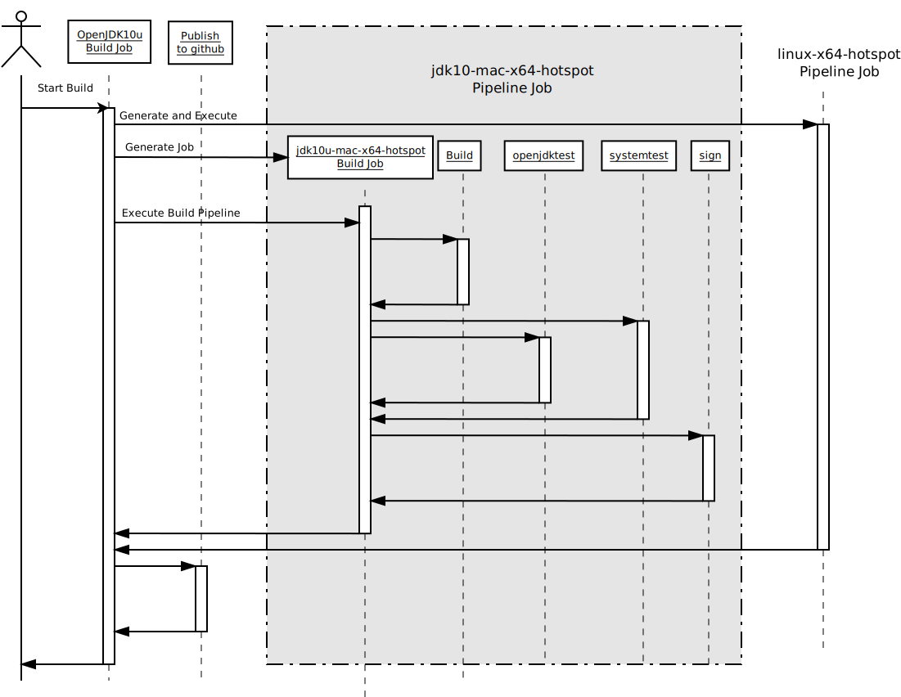

# Build

The build is organised as follows:

## Top level pipeline jobs

These live at https://ci.adoptopenjdk.net/job/build-scripts/. Currently these jobs are:

* [openjdk8-pipeline](https://ci.adoptopenjdk.net/job/build-scripts/job/openjdk8-pipeline/)
* [openjdk9-pipeline](https://ci.adoptopenjdk.net/job/build-scripts/job/openjdk9-pipeline/)
* [openjdk10-pipeline](https://ci.adoptopenjdk.net/job/build-scripts/job/openjdk10-pipeline/)
* [openjdk11-pipeline](https://ci.adoptopenjdk.net/job/build-scripts/job/openjdk11-pipeline/)

** From here on in this documentation describes the 10 pipeline however it is the same for all Java versions. **

The high level sequence of each of these pipelines is shown in:

This shows a build of `jdk10-mac-x64-hotspot` and `jdk10-linux-x64-hotspot`. The `jdk10-mac-x64-hotspot` build is expanded as
an example of how each build pipeline works, however a similar pipeline will be generated for every `jdk10-<os>-<arch>-<impl>`
that was requested to be built.

### Top level pipeline code

The actions of the pipeline are defined by [openjdk10_pipeline.groovy](/pipelines/build/openjdk10_pipeline.groovy), which 
calls [build_base_file.groovy](/pipelines/build/build_base_file.groovy).

The actions of this script are:

1. Read in build configuration that determines what configurations have been requested to be built.
1. For each requested configuration generate a configuration that defines such things as which nodes to run the build on, optional configuration added to [openjdk10_pipeline.groovy](/pipelines/build/openjdk10_pipeline.groovy) etc.
1. Generate a build job for each requested configuration, these live at [jdk10u](https://ci.adoptopenjdk.net/job/build-scripts/job/jobs/job/jdk10u/) 
1. Execute all build jobs in parallel
1. Publish binaries to GitHub

#### Generated build jobs

These are generated using the template at [create_job_from_template.groovy](/pipelines/build/create_job_from_template.groovy)
This defines a pipeline job that calls [openjdk_build_pipeline.groovy](/pipelines/build/openjdk_build_pipeline.groovy), this script defines the work of what a Build Pipeline does. 

## Build Pipelines

Generated by [create_job_from_template.groovy](/pipelines/build/create_job_from_template.groovy), and its work defined in [openjdk_build_pipeline.groovy](/pipelines/build/openjdk_build_pipeline.groovy).

The actions of this are:

1. Execute build
1. Spawn requested test pipelines, these are defined in [openjdk10_pipeline.groovy](/pipelines/build/openjdk10_pipeline.groovy)
1. Call sign binaries job if needed
1. Archive file

### Execute build

This is kicked off by the Build Pipeline, this involves calling [make-adopt-build-farm.sh](/build-farm/make-adopt-build-farm.sh).
This script defines some platform specific configuration such as operating system and architecture specific config defined in [platform-specific-configurations](/build-farm/platform-specific-configurations).
Then it calls [make-adopt-build-farm.sh](/build-farm/make-adopt-build-farm.sh) to finally invoke the build.

