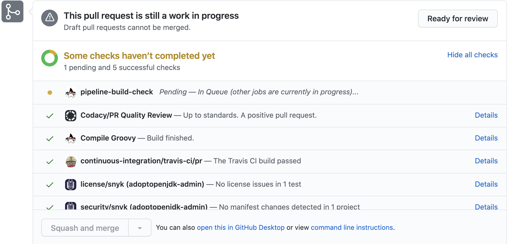
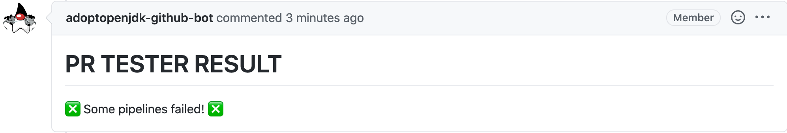

# PR Testers

openjdk-build is an open source project, therefore, we need to ensure the the code that is being deployed to our master branch doesn't break any existing code and actually works as expected.
To achieve this level of testing, we use various jobs to compile, lint and test the code as well as running demo pipelines in a controlled sandbox environment if needs be.
The demo pipelines are colloquially known as "The PR Tester" where the others are generally just referred to as "`checkname` check".

## When they're used

Except for the [#openjdk-build-pr-tester](#openjdk-build-pr-tester), all of the [test groups](#what-they-are) are executed automatically on every PR and are defined inside the [.github/workflows directory](https://github.com/AdoptOpenJDK/openjdk-build/tree/master/.github/workflows).
These tests lint & compile the code you have altered, as well as executing full JDK builds using your code.
Every new pull request to this repository that alters any groovy code OR that will likely affect our Jenkins builds should have the PR tester ([#openjdk-build-pr-tester](#openjdk-build-pr-tester)) run on it at least once to verify the changes don't break anything significant inside a Jenkins build environment (documentation changes being excluded from this rule).

## What they are

There are four "groups" of tests that can be run on each PR:

- [#Compile](#Compile)
- [#Linter](#Linter)
- [#Build](#Build)
- [#openjdk-build-pr-tester](#openjdk-build-pr-tester) (**OPTIONAL, SEE [#When they're used](#When-they're-used)**)

The results of these jobs will appear as [GitHub Status Check Results](https://docs.github.com/en/github/administering-a-repository/about-required-status-checks) at the bottom of the PR being tested:


### Compile

This group consists of [GitHub Status Checks](https://docs.github.com/en/free-pro-team@latest/github/collaborating-with-issues-and-pull-requests/about-status-checks) run inside GitHub itself. They compile and unit test any code changes you have made.

#### Groovy

- A relatively small job, this runs our groovy compiler, checking over the repository to ensure any new code successfully runs and conforms to our test suite.
- Should you encounter a compile error that is caused by a missing function or error similar to the one below, then you should update our [test doubles & stubs](https://github.com/AdoptOpenJDK/openjdk-build/tree/master/pipelines/src/main/groovy) that we use to run these tests and emulate a live jenkins environment ([link to example](https://github.com/AdoptOpenJDK/openjdk-build/commit/27064de6cb4818a8a958476784d2d9b5cb92c55d#diff-c6a79675da9c67a69aa3ee6e26748793)).

```groovy
    prTester/pr_test_pipeline.groovy: 99: [Static type checking] - Cannot find matching method PullRequestTestPipeline#downstreamCommitStatus(groovy.lang.Closure). Please check if the declared type is correct and if the method exists.
     @ line 99, column 33.
                                       downstreamCommitStatus {
```

- The job also runs our [groovy testing suite](https://github.com/AdoptOpenJDK/openjdk-build/tree/master/pipelines/src/test/groovy). The various tests in this directory ensure that our jenkins library classes return the correct information.

- **If you are making any changes to any of the following classes, we strongly recommended you update the tests to conform to your changes (adding new ones if needs be!):**

  - [ParseVersion.groovy](https://github.com/AdoptOpenJDK/openjdk-build/blob/master/pipelines/library/src/ParseVersion.groovy)
  - [IndividualBuildConfig.groovy](https://github.com/AdoptOpenJDK/openjdk-build/blob/master/pipelines/library/src/common/IndividualBuildConfig.groovy)
  - [RepoHandler.groovy](https://github.com/AdoptOpenJDK/openjdk-build/blob/master/pipelines/library/src/common/RepoHandler.groovy)
  - [MetaData.groovy](https://github.com/AdoptOpenJDK/openjdk-build/blob/master/pipelines/library/src/common/MetaData.groovy)
  - [VersionInfo.groovy](https://github.com/AdoptOpenJDK/openjdk-build/blob/master/pipelines/library/src/common/VersionInfo.groovy)

- As an example of this in action, the output of [one such test](https://github.com/AdoptOpenJDK/openjdk-build/blob/master/pipelines/src/test/groovy/VersionParsingTest.groovy#L60-L68) can be seen below:

```groovy
VersionParsingTest > parsesJava11NightlyString() STANDARD_OUT
    =JAVA VERSION OUTPUT=
    openjdk version "11.0.3" 2019-04-16
    OpenJDK Runtime Environment AdoptOpenJDK (build 11.0.3+9-201903122221)
    OpenJDK 64-Bit Server VM AdoptOpenJDK (build 11.0.3+9-201903122221, mixed mode)
    =/JAVA VERSION OUTPUT=
    matched
    11.0.3+9-201903122221
```

- To run the suite locally:

```bash
cd pipelines/
./gradlew --info test
```

### Linter

This group consists of [GitHub Status Checks](https://docs.github.com/en/free-pro-team@latest/github/collaborating-with-issues-and-pull-requests/about-status-checks) run inside GitHub itself. They lint / analyse any changes you make to ensure they conform to our writing standards.

#### Shellcheck

- This job downloads and runs the [Shellcheck script analysis tool](https://www.shellcheck.net/) in order to lint and compile any changes you have made to our bash scripts. It does this via the [shellcheck.sh](https://github.com/AdoptOpenJDK/openjdk-build/blob/master/shellcheck.sh) script.
- The job will fail and inform the user in the log if there are any violations of our bash scripting standards. If you feel that some of the standards are too strict or irrelevant to your changes, please raise it in [Slack:#testing](https://adoptopenjdk.slack.com/archives/C5219G28G).

### Build

This group is a matrix of [GitHub Status Checks](https://docs.github.com/en/free-pro-team@latest/github/collaborating-with-issues-and-pull-requests/about-status-checks) run inside GitHub itself. They execute a full set of builds to various specifications, mimicking a user running a build locally

- The group collects a varied mix of java versions, operating systems and VM variants that each execute [build-farm/make-adopt-build-farm.sh](https://github.com/AdoptOpenJDK/openjdk-build/blob/master/build-farm/make-adopt-build-farm.sh), essentially running a full JDK build as if we were setting up and testing a new Jenkins machine OR as if it was running a build locally on your machine.
- Each job is run inside a Docker container to ensure reliability between each build. For example, Linux builds use our [centos7_build_image](https://hub.docker.com/r/adoptopenjdk/centos7_build_image) Docker container.
- At the end of the build, the finished JDK artifact is archived to GitHub for you to download and peruse at your leisure (see [actions/upload-artifact#usage](https://github.com/actions/upload-artifact#usage) for more info).
- Due to GitHub ratelimiting how many status checks can be run in the space of a few minutes, these checks may take a little while to complete while they're stuck in the queue. Be patient however, as some of your changes may affect one build completely differently to another build.

### openjdk-build-pr-tester

- **Seen in the PR Status Checks as `pipeline-build-check`, the job is located [here](https://ci.adoptopenjdk.net/job/build-scripts-pr-tester/job/openjdk-build-pr-tester/)**
- This job runs the a set of [sandbox pipelines](https://ci.adoptopenjdk.net/job/build-scripts-pr-tester/job/build-test/) to test the changes that you have made to our codebase.
- It first executes [kick_off_tester.groovy](https://github.com/AdoptOpenJDK/openjdk-build/blob/master/pipelines/build/prTester/kick_off_tester.groovy) which in turn kicks off our [pr_test_pipeline](https://github.com/AdoptOpenJDK/openjdk-build/blob/master/pipelines/build/prTester/pr_test_pipeline.groovy), the main base file for this job.
- NOTE: This tester is only really worth running if your code changes affect our groovy code OR Jenkins environment. Otherwise, the [#Build](#Build) jobs are sufficient enough to flag any problems with your code.

#### Usage

The tester has it's own admin and white lists on Jenkins.
If you are on either list, the PR tester will run against your PR whenever you comment [#run tests](#run-tests) and will also allow you access to various commands you can run on your own PR or on someone else's:

##### `run tests`

- Executes a new [#openjdk-build-pr-tester](#openjdk-build-pr-tester) job against this PR. These jobs will populate the GitHub status checks field as described above. Please be patient as the tester does not run concurrently so it may take some time to execute the jobs if there is a long job queue. You can track the progress of it in [Jenkins](https://ci.adoptopenjdk.net/job/build-scripts-pr-tester/) OR look at the status check message:

  - Example of a PR that is in the queue:
  
  - One that is at the front of the queue and currently being tested:
  

- When the tester is done, it will return a response comment to the PR with feedback on the testing similar to the following:


- The message will vary depending on the result of the test. Please remember however, that failed tests may be due to existing problems in the nightly builds, not your code. If you're unsure if the tests failed because of your changes or not, check our [issue board](https://github.com/AdoptOpenJDK/openjdk-build/issues) and our [triage doc](https://docs.google.com/document/d/1vcZgHJeR8rW8U8OD23Uob7A1dbLrtkURZUkinUp7f_w/edit?usp=sharing) for the existing error. If your job was aborted, check the log to see who aborted it.

  - 🟢**SUCCESS** 🟢 All the downstream jobs passed, congratulations!
  - 🟠**FAILURE** 🟠 Some of the downstream jobs failed OR the job was aborted. Check the link in the field at the bottom of the PR for the job link to see exactly where it went wrong.
  - 🔴**ERROR** 🔴 Something more serious went wrong with the tester itself. Please raise an issue with a link to the job, the error encountered and your PR that caused it (again, you can use the link at the bottom to see exactly what happened).

##### `add to whitelist`

- **ADMIN COMMAND ONLY**
- This command adds a new user to the whitelist but not to the admin list of the [#openjdk-build-pr-tester](#openjdk-build-pr-tester) job. As of typing this, there is [currently no way to check if you have the correct permissions](https://github.com/AdoptOpenJDK/openjdk-build/issues/2055#issuecomment-688801090).
- Should you want to be promoted to the whitelist, please contact one of the admins through [#infrastructure](https://adoptopenjdk.slack.com/archives/C53GHCXL4) in Slack.
- Should you want the up to date admin or white list, check the configuration of the [openjdk-build-pr-tester](https://ci.adoptopenjdk.net/job/build-scripts-pr-tester/job/openjdk-build-pr-tester/) job. If you don't have the permissions to view the configuration, then try out the `add to whitelist` and `run tests` commands on a test PR to see if they work.
